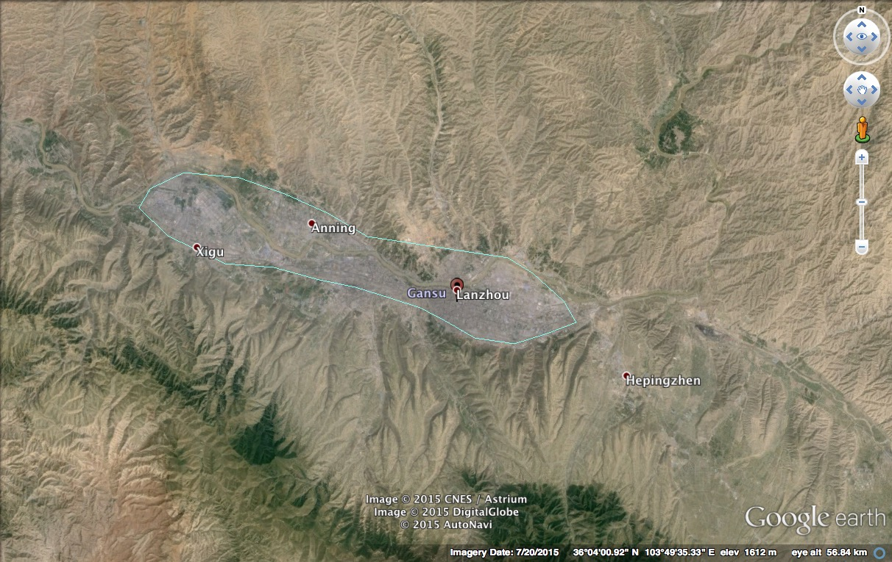

#兰州，母亲黄河

### 兰州印象
经过一个晚上的火车哐当之后，早上天蒙蒙亮时候，火车到达了兰州站。
昼夜温差比较大（13度左右），早上还是有点冷，不过在火车上闷了一个晚上之后，虽然外面的温度只有10多度，但是呼吸进去的冷空气倒是令人十分的舒畅，两个南方来的小伙伴，穿着短袖也不感觉冷了。

> 兰州，黄河由西向东穿城而过；南北狭窄（最窄处只有大概1KM），南靠青藏高原，北望蒙古高原；东西狭长，沿着黄河而修建的城；缺水，黄土，绿化不足，有沙尘暴。

这是到达兰州之前的印象，到了之后，发现兰州不缺水，也无黄土，绿化也很好，后来到了河西之后，才知道是误把河西戈壁当作兰州了。

兰州是黄河穿过的唯一一个省会城市，黄河也被兰州人称为母亲河，因此没有黄河就没有兰州，所以去了兰州必须去黄河。

### 兰州黄河风情走廊
沿着黄河修建的黄河风情走廊，也可以称为黄河公园，黄河两岸种上了很多垂柳，要不是干燥的天气，还以为这里是江南，误把兰州当杭州？；当地市民在河堤上散步、跑步、在垂柳下打太极。
河滩上也是垂柳，单更多的是小片的白桦林，空出的空地被用作运动场所，有练武术的，有玩[空竹](http://baike.baidu.com/link?url=51bLG7gXkHw6IUK27koa_CkukOJoNQUJmid2qxJ_RIQfL-GcTpP7iR6PtLthQ1hUd_xJXbtG50WNT5Byqx77CXxYGNZt2uxWtpwKtJ3lVH_)的，对于一对来自文化相对贫瘠城市的小伙伴来说，就觉得这种地方有文化气息。

沿着黄河风情走廊，还有一些收费的娱乐项目，坐船观黄河、水车园、羊皮筏子漂流。

最具有代表性的就是黄河母亲雕像了，属于城市的地标，必须要留影。

### 甘肃省博物馆
要了解一个地方的历史，当然就是去博物馆。作为丝绸之路上的核心节点，现在又是整个河西走廊的省会，这里的博物馆一定要去。去过不同地方的博物馆，有了对比之后，就会发现一个国家或地区，有历史会感觉很荣耀。
甘肃省博物馆镇馆之宝，马踏飞燕，武威雷台出土的，所以不需要去武威，去了也看不着，在兰州就可以看到了。

还有五代十国时期的砖画，保存的很好，没有一点褪色，是因为使用的是化学颜料（红色的是朱砂、绿色的是孔雀石。。。），中国邮政的Logo就是来自这里的一个送信者砖画。

博物馆的重点是丝绸之路，张骞西行带回来的不仅仅是西域的风土人情，还有和底层百姓息息相关的洋瓜果食物：香菜、石榴、大蒜、胡麻（芝麻）、胡桃（核桃）、胡豆（蚕豆）、胡瓜（黄瓜）、苜蓿、葡萄；给汉武帝的汗血宝马；还有胡琴，琵琶。所以从这个角度看，张骞的功劳不亚于玄奘。

丝绸之路之前的历史就是与匈奴的斗争史，现在甘肃就是汉族与匈奴融合的地方。

博物馆还有一部分陶器时代的文物和历史，这个就没啥意思了，文化太低级，每个地方的博物馆都有，一般是用来证明我这个地方好，XXXX年前就有人类活动了。

### 老同学
去一个地方，如果只有风景，看时间长了便会有审美疲劳；有了老友在，感觉就不一样了，会对这个地方多一分亲切感，多一些故事。就好比要是没有“劝君更尽一杯酒，西出阳关无故人”这首诗，没有“阳关三叠”这首词，估计我也不会去阳关看看了。

吃饭喝酒是必须的，完了硬是要我退掉租的车，开他的新车（临时牌只开了15公里），盛情难却，心里多一份感恩。

回来之后再次来到兰州，领着我逛了五泉公园、黄河铁桥、完了又吃了一顿，然后赶上火车回程。
